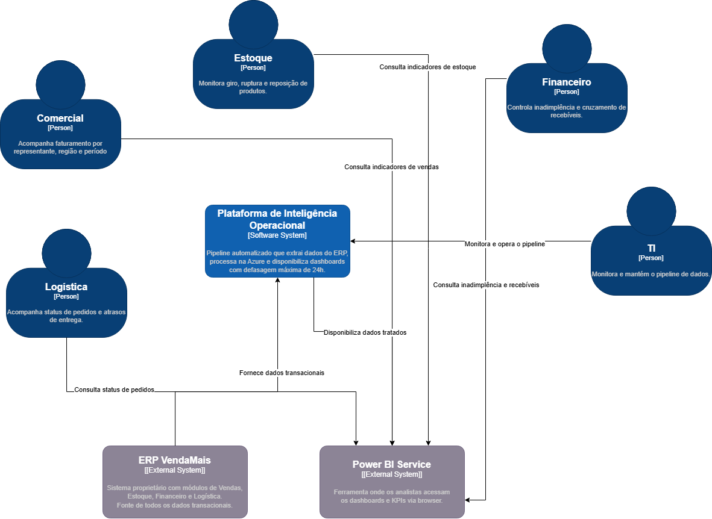

# C4 Nível 1 — Diagrama de Contexto

> **Sistema:** Plataforma de Inteligência Operacional — VendaMais  
> **Nível:** 1 — Context Diagram  
> **Padrão:** C4 Model

## Contexto

A VendaMais Distribuidora Ltda. é uma empresa de médio porte com operações 
em quatro estados, 18 representantes comerciais e volume de aproximadamente 
3.500 pedidos/mês, operando um ERP proprietário desde 2019.

A ausência de visibilidade consolidada sobre indicadores operacionais levou 
à criação de uma Plataforma de Inteligência Operacional. O diagrama abaixo 
representa o sistema no seu contexto externo, identificando os usuários e 
sistemas com os quais ele interage.

## Diagrama

