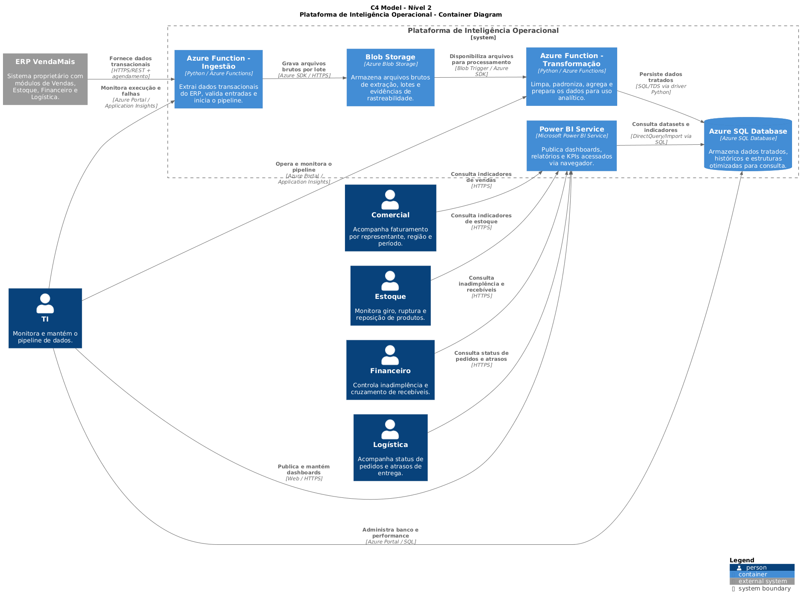

# C4 Model — Nível 2
## Container Diagram — Plataforma de Inteligência Operacional

Este documento apresenta o diagrama de containers da **Plataforma de Inteligência Operacional** da VendaMais.  
A solução segue o pipeline arquitetural definido no projeto: **Ingestão → Armazenamento → Transformação → Banco → Consumo**, com o objetivo de disponibilizar indicadores com defasagem máxima de 24 horas.

## Visão geral

A Plataforma de Inteligência Operacional extrai dados do ERP VendaMais, armazena arquivos brutos no Azure Blob Storage, processa e transforma esses dados com Azure Functions, persiste as informações tratadas no Azure SQL Database e disponibiliza dashboards no Power BI Service para as áreas de negócio.

## Containers

### 1. Azure Function - Ingestão
- **Tecnologia:** Python / Azure Functions
- **Responsabilidade:** extrair dados transacionais do ERP, validar entradas e iniciar o pipeline
- **Comunicação:** HTTPS/REST com o ERP e Azure SDK/HTTPS com o Blob Storage

### 2. Blob Storage
- **Tecnologia:** Azure Blob Storage
- **Responsabilidade:** armazenar arquivos brutos de extração, lotes e evidências de rastreabilidade
- **Comunicação:** Azure SDK / HTTPS e Blob Trigger

### 3. Azure Function - Transformação
- **Tecnologia:** Python / Azure Functions
- **Responsabilidade:** limpar, padronizar, agregar e preparar os dados para uso analítico
- **Comunicação:** leitura via Blob Trigger / Azure SDK e escrita no banco via SQL/TDS

### 4. Azure SQL Database
- **Tecnologia:** Azure SQL Database
- **Responsabilidade:** armazenar dados tratados, históricos e estruturas otimizadas para consulta
- **Comunicação:** SQL/TDS

### 5. Power BI Service
- **Tecnologia:** Microsoft Power BI Service
- **Responsabilidade:** publicar dashboards, relatórios e KPIs acessados via navegador
- **Comunicação:** HTTPS e consulta ao Azure SQL Database via DirectQuery/Import

## Relações principais

- **ERP VendaMais → Azure Function - Ingestão:** fornece dados transacionais via HTTPS/REST
- **Azure Function - Ingestão → Blob Storage:** grava arquivos brutos por lote
- **Blob Storage → Azure Function - Transformação:** disponibiliza arquivos para processamento
- **Azure Function - Transformação → Azure SQL Database:** persiste dados tratados
- **Power BI Service → Azure SQL Database:** consulta datasets e indicadores

## Atores e uso

- **Comercial:** consulta indicadores de vendas
- **Estoque:** consulta indicadores de estoque
- **Financeiro:** consulta inadimplência e recebíveis
- **Logística:** consulta status de pedidos e atrasos
- **TI:** monitora e mantém o pipeline de dados

## Observação

O diagrama foi modelado conforme a notação C4, mantendo a separação entre:
- pessoas/atores
- sistema externo (ERP VendaMais)
- containers da solução
- relações nomeadas com tecnologia/protocolo